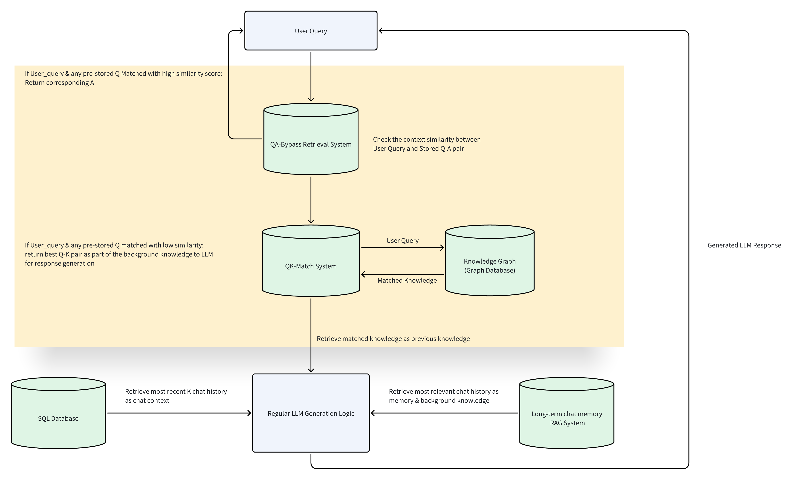

本文档用于说明RAG（Retrieval Augmented Generation）系统中检索知识库相关构建流程。
注意，阅读本文档前请先完成RAG功能API文档的阅读。RAG系统架构如下图所示。

## 1.代码结构与文件位置

## 2.论坛知识爬取
### 2.1 主要工作：
脚本文件：[faceMindTrendsCrawlUtils.py](https://github.com/FaceMindCodeBase/FaceMind_Trends_Backend/blob/crawling_time/utils/faceMindTrendsCrawlUtils.py)
 1. 添加功能：对发帖、评论时间的进行爬取并和内容互相配对
**函数原型**`  def fill_content_into_thread(thread: Thread, url: str, page: int, page_max: int,comment_idx:int=0): `
**参数说明**
* thread (Thread)：代码中定义的class Thread类型的实例
* url (str)：要进行爬取的详细帖子页面的url
* page(int)：当前所在的帖子内容的页面索引
* page_max(int)：对每个帖子爬取的最大页面数，因为每个帖子的评论内容显示不止一个页面
* comment_idx(int)：当前页面评论的起始索引
**返回值**
* None。该方法对Thread实例进行修改，将爬取的信息填充到Thread实例中。
 2. 修改功能：指定爬取的有效帖子数量
**函数原型**`  def crawl_and_rephrase(game: str, section: str, url: str,counts:int=1000, model: str="gpt-3.5-turbo", temperature: float=1.0, thread_list_pages: int=2, rephrase_attemps: int=3): `
**参数说明**
* game(str)：要爬取的NGA论坛的模块
* section(str)：指定模块下的细分模块，若为空则表示直接爬取主板信息
* url(str)：指定模块的url
* counts(int)：指定需要爬取的有效帖子数
* Others：在爬虫功能中属于无效参数，此处无需使用
**返回值**
* None。该方法将爬取的内容存储到项目结构中/cache/filter_txt和/cache/crawl_json中。其中crawl_json存储爬取的帖子信息，filter_txt存储对帖子内容进行过滤后的信息，过滤方法仅保留点赞数排名靠前的15条评论。
### 2.2 爬虫使用方法：
将[爬虫代码](https://github.com/FaceMindCodeBase/FaceMind_Trends_Backend/tree/crawling_time)clone下来之后运行faceMindTrendsCrawler.py即可。
## 3.基于LLM的知识提取

## 4.Milvus数据库存储知识

## 5.检索知识增强生成全流程

